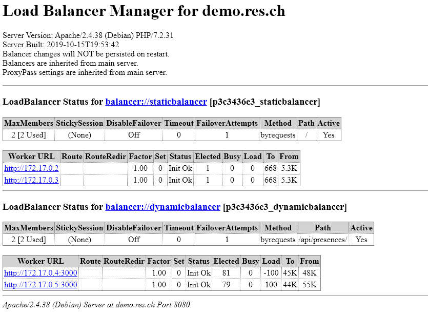
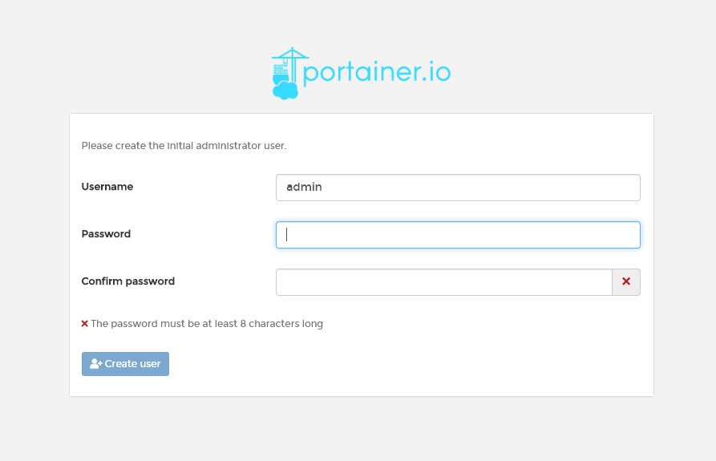
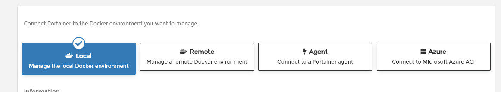
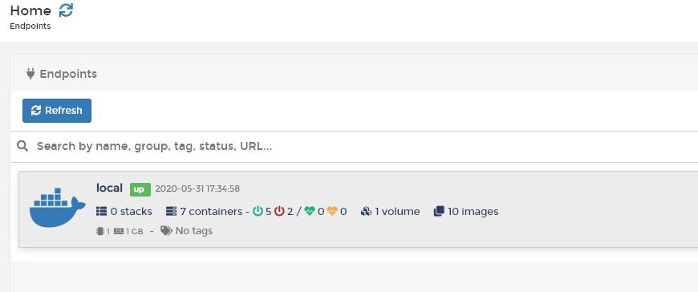
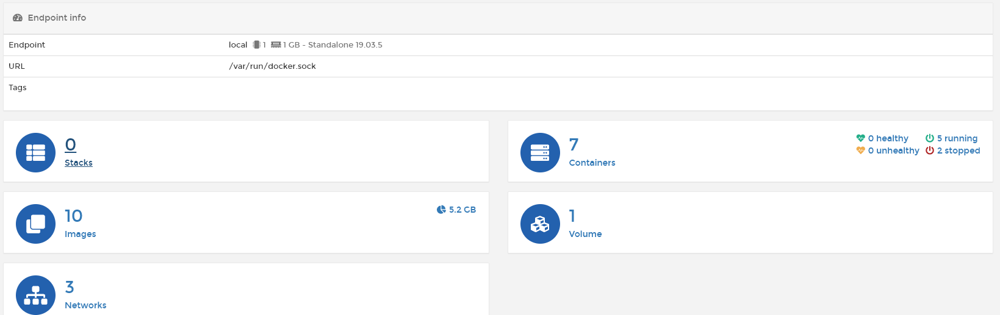
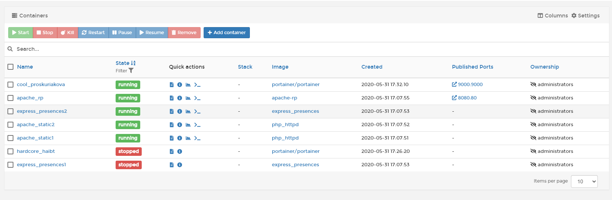

# Laboratoire infrastructure HTTP

## Etape 1: Serveur HTTP statique avec Apache httpd

Après avoir forké le repo du laboratoire, nous allons créer un container Docker à partir de l'image php sur docker.hub et contenant un serveur httpd fonctionnel. 

### Build de l'image, run du container et test d'accès depuis un browser
Nous allons d'abord créer la structure du contenu statique que nous voulons afficher sur notre serveur. Pour celà nous allons choisir un template bootstrap déniché sur internet et customisé pour présenter le cours RES. Nous allons placer ce contenu dans un dossier content.

Nous allons ensuite créer un Dockerfile dans le même dossier que le dossier content et allons y spécifier le contenu suivant. Nous utiliserons une image Docker contenant PHP couplé à un serveur Apache.

```
#On récupère l'image sur dockerhub
FROM php:7.2-apache
#Copie du contenu du dossier content (filesystem local) dans le répertoire du serveur web de l'image
COPY /content/ /var/www/html/
```

Génération de l'image avec la commande en étant dans le répertoire du Dockerfile.
```
docker build --tag php_httpd .
```

Lancement d'un container avec l'image créée et écoutant sur le port 8080. On a du port forwarding du port 8080 de l'hôte sur le port 80 du container.

```
docker run -d -p 8080:80 php_httpd
```

On peut ensuite y accéder en tappant 192.168.99.100:8080 dans le navigateur. L'adresse ip est celle-ci car j'utilise Docker Toolbox sur mon pc pour l'utiliser conjointement avec mes machines virtuelles. L'IP d'accès peut ainsi varier selon la configuration du poste.

### Fichier de configuration Apache

Les fichiers de configurations sont accessible dans le répertoire /etc/apache2 et on s'intéresse pour le moment plus spécifiquement aux fichiers apache2.conf et /sites-available/000-default.conf.

Le premier est le point central de toute la configuration du serveur Apache. En effet, la configuration est scindée en plusieurs fichiers de configuration. Ce fichier fait le lien entre eux.

Le 2ème contient les configuration propres aux hôtes virtuels et aux chemin d'accès aux racines des différents sites ainsi qu'aux ports qui leurs sont attribués.


## Etape 2: Serveur HTTP dynamique avec express.js
Dans cette partie, nous allons écrire une application Node.js et apprendre à utiliser Postman pour tester notre application.

### Récupération de l'image et Dockerfile
Nous allons utiliser l'image node:12.16.3 qui est la dernière version stable et est disponible sur hub.docker.

Le Dockerfile se décline comme ceci.
```
FROM node:12.16.3
COPY src /opt/app

CMD ["node", "/opt/app/index.js"]
```

### Initialisation de l'application NodeJS

Dans le répertoire src que nous allons copier dans notre container, nous allons lancer la commande suivante pour initialiser l'application. Mais avant celà, il nous faut installer NodeJS sur notre machine en téléchargeant l'installer sur le [site de NodeJS](https://nodejs.org/en/download/).
```
npm init
```

Cette commande va générer un fichier package.json qui contient les informations propres à notre application.

La commande suivante va ajouter la dépendance chance.js pour la génération de contenu aléatoire dans le package.json.

```
npm install --save chance
```

La suite de commandes précédentes génère le package.json suivant.

```
{
  "name": "presences",
  "version": "0.1.0",
  "description": "Une application de gestion des presences",
  "main": "index.js",
  "scripts": {
    "test": "echo \"Error: no test specified\" && exit 1"
  },
  "author": "Julien Brunisholz",
  "license": "ISC",
  "dependencies": {
    "chance": "^1.1.4"
  }
}

```

On fait un build de l'image et on lance un container, ceci va avoir pour effet d'afficher un nom aléatoire dans notre console. Notre container s'arrête dès la fin du script du coup pas moyen pour le moment de l'accéder depuis un navigateur par exemple.

### Implementation d'un serveur HTTP en NodeJS

#### Installation du framework Express.js et test de fonctionnement

On lance la commande suivante pour installer le framework dans notre répertoire src.

```
npm install --save express
```

Le répertoire node_modules contient les dépendances des différents packages installés, en général, on défini ce dossier dans le fichier .gitignore car il est volumineux.

On insère ensuite le code suivant dans notre index.js.

```Node.js
var Chance = require('chance');
var chance = new Chance();

var express = require('express');
var app = express();

app.get('/', function(req, res) {
        res.send("Hello RES");
});

app.listen(3000, function () {
        console.log('Accepting HTTP requests on port 3000!');
});
```

On va donc écouter sur le port 3000 avec notre application et dès qu'une requête HTTP (GET) venant d'un client est reçue avec comme contenu '/', on retourne un message.

Pour lancer notre application en local
```
node index.js
```

Pour se connecter en telnet à notre application
```
>telnet localhost 3000
>GET / HTTP/1.0
```

#### Création d'une première petite application en NodeJs

Pour se familiariser avec NodeJs, le framework Express.js et l'outil chance.js, nous avons modifier l'index.js pour qu'il renvoie une liste au format json de membres avec une liste de présences.

```Node.js
var Chance = require('chance');
var chance = new Chance();

var express = require('express');
var app = express();

app.get('/', function(req, res) {
        res.send( generatePresencesAndMembers() );
});

app.listen(3000, function () {
        console.log('Accepting HTTP requests on port 3000!');
});

// Génère un nombre de présence aléatoires pour des membres
function generatePresencesAndMembers() {
        var numberOfPresences = bordedRandomNumber(1,4);
        var numberOfMembers = bordedRandomNumber(1,5);

        //Un membre a un nom, un prénom, un sexe et une date de naissance et un tableau //de présences
        var members = [];


        for(var i = 0; i < numberOfMembers; i++) {
                var gender = chance.gender();
                var firstName = chance.first({gender: gender});
                var lastName = chance.last({gender: gender});
                var birthDate = chance.date({string: true, american: false});

                var presences = [];;

                for(var j = 0; j < numberOfPresences; j++) {
                        presences.push({
                                date: chance.date({string: true, american:false}),
                                eventLocation: chance.city()
                        });
                }

                members.push({
                                firstName: firstName,
                                lastName: lastName,
                                gender: gender,
                                birthDate: birthDate,
                                presences: presences
                        });
        }

        console.log(numberOfMembers);
        console.log(numberOfPresences);

        return members;

}

// Retourne un nombre aléatoire entre min et max
function bordedRandomNumber(minV, maxV) {
        return chance.integer({
                min: minV,
                max: maxV
        });
}
```

## Step 3: Reverse proxy with apache (static configuration)
Cette partie a pour but la mise en place d'un reverse proxy, c'est à dire un point central d'accès à notre infrastructure web. Ce reverse proxy va en effet recevoir les différentes requêtes adressées à notre infrastructure et les dispatcher vers la bonne destination interne.

### Démarrage des container et tests de fonctionnement
Nous allons ici démarrer des container à partir des images créées dans les deux étapes précédentes.

```
>docker run -d --name apache_static php_httpd
>docker run -d --name express_dynamic express_presences

```

Ensuite, grâce à la commande docker inspect pour chaque container, on trouve (dans NetworkSettings/IPAddress) l'adresse IP donnée au container.

* 172.17.0.2 pour apache_static
* 172.17.0.2 pour express_dynamic

Utilisant powershell sous windows comme interface de ligne de commande, cette commande correspond à un grep -i en bash
```Powershell
>docker inspect apache_static | Select-String -Pattern IPAddress
```

```bash
>docker inspect apache_static | grep -i IPAddress
```
Ce qui nous donne la sortie suivante
```
"SecondaryIPAddresses": null,
"IPAddress": "172.17.0.2",
	"IPAddress": "172.17.0.2",
```

On peut ensuite tester nos container. Pour ceci, nous utilisons la commande suivante.

```
>docker-machine ssh
```
qui nous permet de nous connecter à notre machine virtuelle docker pour atteindre nos container. En effet, ceux-ci ne sont pas accessibles depuis l'extérieur du fait que nous n'avons pas fait de port forwarding.

On lance ensuite une connexion telnet à chaqun des container puis on leur envoie une requête HTTP.

```
GET / HTTP/1.0
```

### Configuration du Reverse Proxy et routage des requêtes

Dans cette configuration, les adresses ip des containers sont insérées en dur dans la configuration. Cette manière de faire n'est pas souhaitable si on souhaite obtenir une solution robuste. En effet, les adresses ip assignées aux container peuvent varier.

Notre reverse proxy va être implémenté dans un container Docker basé sur la même image que pour le contenu statique que nous avons créé auparavant. L'image php:7.2-apache.

La configuration voulue pour le reverse proxy doit nous permettre:

* d'atteindre le site statique dans le container apache_static en spécifiant la requête
```
GET / HTTP/1.0
Host: demo.res.ch
```
* d'atteindre le site dynamique (liste de présence) du container express_dynamic via la requête
```
GET /api/presences/ HTTP/1.0
```
#### configuration Dockerfile et des fichiers de configuration Apache
Nous allons créer un nouveau répertoire apache-reverse-proxy qui va contenir les fichiers nécessaires à la création de notre image personnalisée pour le reverse proxy.

Tout d'abord, un petit mot sur la structure de la configuration d'Apache.
/etc/apache2, est le répertoire contenant les fichiers de configuration du service Apache. Ses sous-dossiers importants pour notre configuration sont :

* mods-available : les modules disponibles
* mods-enabled : les modules activés via l'utilitaire a2enmod
* sites-available : les sous-sites disponibles
* sites-enabled : les sous-sites activés via l'utilitaire a2ensite

Le Dockerfile de notre image sera le suivant.

```
FROM php:7.2-apache                                                                                                                                                                                                                                                         COPY conf/ /etc/apache2                                                                                                                                                                                                                                                     RUN a2enmod proxy proxy_http                                                                                                          RUN a2ensite 000-* 001-*
```
La commande COPY va copier les fichiers de configuration Apache dans le répertoire de configuration du container à sa création. Ici il s'agit de copier le contenu du dossier sites-available (sous-dossier de conf) dans le container pour définir les 2 sites :
* 000-default.conf qui définit le virtual host par défaut. On le défini comme ça pour que le client, s'il envoie une requête sans définir l'en-tête "Host:", n'arrive pas sur la configuration statique.

RUN a2enmod ... va lancer l'utilitaire pour installer les 2 modules nécessaires pour configurer le proxy sur notre serveur.

RUN a2ensite ... va activer les deux sites que nous avons copié précédemment.

```
<VirtualHost *:80>
</VirtualHost>
```

* 001-reverse-proxy.conf qui défini les paramètres du routage vers nos deux containers.

```
<VirtualHost *:80>
        ServerName demo.res.ch

        ProxyPass "/api/presences/" "http://172.17.0.3:3000/"
        ProxyPassReverse "/api/presences/" "http://172.17.0.3:3000/"

        ProxyPass "/" "http://172.17.0.2:80/"
        ProxyPassReverse "/" "http://172.17.0.2:80/"
</VirtualHost>
```
Dans ce fichier, on peut voir qu'on spécifie le ServerName, donc le contenu de l'en-tête Host: attendu, Proxy Pass va spécifier une réécriture de l'url. Donc quand le client envoie "/api/presences/" au reverse proxy, celui-ci va faire passer l'URL "http://172.17.0.3:3000/" et ainsi permettre d'être opaque sur la structure présente derrière lui.

A l'inverse on réécrit l'URL de base pour les réponses venant dans l'autre sens.


Nous allons ensuite générer notre image via la commande docker build sous le nom "apache-rp".
Puis nous allons lancer un container avec la commande suivante.

```
docker run -d -p 8080:80 apache-rp
```

#### Vérification du fonctionnement correct de nos routes

Si on tape l'adresse ip de la VM Docker avec le port 8080, on atteint bien une page d'interdiction d'accès. En effet, on suit le sous-site par défaut 000.

Il faut maintenant configurer le nom DNS demo.res.ch dans notre fichier hosts pour le faire correspondre à l'adresse ip de notre VM. Pour celà et sous Windows, il faut aller sous C:\Windows\System32\drivers\etc\hosts et insérer la ligne suivante dans le fichier.

```
192.168.99.100 demo.res.ch
```

## Step 4: AJAX requests with JQuery

Dans cette partie, nous allons faire en sorte que notre site accessible via demo.res.ch fasse une requête ajax pour afficher le contenu dynamique envoyer par notre server web dynamique.

Nous allons d'abord modifier le Dockerfile de notre image apache-php-image et insérer les commandes d'installation de vim.

```
FROM php:7.2-apache

RUN apt-get update && \
  apt-get install -y vim

COPY /content/ /var/www/html/
```

et effectuer à nouveau un docker build pour créer une nouvelle image. On se connecte ensuite au container interactivement avec la commande docker run -it pour vérifier que l'outil vi fonctionne bien dans le container.

On effectue la même manipulation sur les deux autres images que nous avions créé précédemment.

On va nommer nos container ainsi :

* apache_rp pour l'image apache-rp
* express_presences pour l'image express_presences
* apache_static pour l'image php_httpd

Ayant spécifier les adresses IP en dur pour nos containers, il nous faut vérifier que les même IP ont été attribuées à nos nouveaux container, sinon nous devrons modifier les IP dans la configuration de notre Reverse Proxy.


### Requête Ajax pour récupérer la liste dynamique

Grâce à JQuery, nous allons récupérer la liste retournée par /api/presences/ et l'afficher dans la page statique de notre container statique en mettant à jour les données affichées à intervalle régulier.

Notre api nous renvoie un tableau de membres ayant chacun un tableau associé avec ses présences, on veut afficher le tableau complet sur notre page statique.

Nous allons travailler dans nos container Docker directement, nous allons donc lancer un docker exec interactif sur /bin/bash pour entrer dans le container et pouvoir modifier les fichiers.

#### Appel au script et ajout d'élément DOM d'accueil dans index.html

D'abord, dans index.html de notre container apache_static, nous allons ajouter la ligne suivante pour appeler le script que nous allons créer ensuite.

```html
<script src="js/presences.js"></script>
```

Il nous faut ensuite un élément dans lequel accueillir notre contenu. Pour celà, nous allons ajouter une classe "presences" dans notre page html.

```html
<h3> Here is our presences list </h3>
<div class="presences"></div>
```

#### Création de la structure de dossier et du script presences.js

Nous allons maintenant créer un dossier js qui accueillera nos scripts et allons y créer un fichier "presences.js".

```javascript
$(function() {
	console.log("Loading presences");

	function loadPresences() {
		$.getJSON("/api/presences/", function(presences) {
			console.log(presences);
			var message = "Hobody was present...";
			if (presences.length > 0) {
				
				//Recuperation des headers du json
				var col = [];
				
				for(var i = 0; i < presences.length; i++){
					for (var key in presences[i]) {
						if(col.indexOf(key) === -1) {
							col.push(key);
						}
					}
				}

				//Creation du tableau
				var table = document.createElement("table");
				var tr = table.insertRow(-1);

				for (var i = 0; i < col.length; i++) {
					var th = document.createElement("th");
					th.innerHTML = col[i];
					tr.appendChild(th);
				}

				for (var i = 0; i < presences.length; i++){
					tr = table.insertRow(-1);

					for(var j = 0; j < col.length; j++) {
						var cell = tr.insertCell(-1);
						
						//Creation d'une liste de presences à insérer dans une cellule du tableau
						if(j == 4){
							var list = $('<ul/>').appendTo(cell);
							for(var k = 0; k < presences[i][col[j]].length; k++){
								var li = $('<li/>').appendTo(list).html((presences[i][col[j]])[k]['date'] + ' : ' + (presences[i][col[j]])[k]['eventLocation']);
							}		
						}
						else{
							cell.innerHTML = presences[i][col[j]];
						}
					}
				}

				message = table;
			
			}
			// Supprimer l'ancien tableau et afficher le nouveau contenu
			$(".presences").empty();	
			$(".presences").append(message);
		});
	};

	loadPresences();
	//lancement de la fonction à intervalle régulier
	setInterval(loadPresences, 5000);
});
```

Le style CSS a aussi été modifié pour permettre l'affichage du tableau, il est placé dans le sous-dossier assets.

Les modifications qui précèdent ont été faites sur un container docker en fonction via l'invite de commande interractive. Le fonctionnement ayant été validé, on va copier les fichiers modifier dans la structure de dossier de notre image apache_static et regénérer une nouvelle image avec la commande docker build et relancer nos container.


## Etape 5 : Configuration dynamique pour le reverse proxy

Dans une étape précédente, nous avions mis en place un reverse proxy faisant office de point central d'entrée dans notre infrastructure et permettant de router les requêtes reçues. Néanmoins, sa configuration est statique, se basant sur des adresses ip hardcodées. Cette étape vise à modifier la configuration de ce reverse proxy dynamiquement par rapport aux adresses ip des containers qui sont lancés.

On va en premier lieu supprimer tous les containers avec la commande.

```
> docker rm `docker ps -qa`
```

### Passage de variables à un container via docker run

Il est possible de passer une variable via la commande suivante au lancement d'un container.

```
> docker run -e MAVARIABLE=MAVALEUR -it apache_rp /bin/bash
```

La variable sera ensuite visible comme variable d'environnement dans le container. On peut l'afficher via la commande export.

### Dockerfile et script de configuration dynamique

Notre objectif est de faire en sorte que la configuration du fichier 001-reverse-proxy.conf, que nous avons pour le moment spécifié en dur, soit créé dynamiquement au lancement d'un nouveau container en fonction des IPs des containers.

Nous allons d'abord observer le contenu du Dockerfile de l'image PHP que nous récupérons sur dockerhub. On peut voir qu'en fin de fichier, l'appel au script ``` CMD ["apache2-foreground"]``` est effectué. Cette commande est nécessaire pour que le container ne se termine pas tout de suite.

Nous allons modifier le script apache2-foreground pour ce faire.

Pour apprendre ceci, nous sommes allé consulté le Dockerfile utilisé par l'image de base pour notre server apache [ici](https://github.com/docker-library/php/blob/057b438e69093c927a84cce4308c7ad08ccdd5b0/7.2/buster/apache/Dockerfile).


#### Modification du Dockerfile de l'image du reverse proxy

On va devoir copier notre propre version du script apache2-foreground dans l'image, on va donc modifier notre docker file pour ce faire en ajoutant la ligne suivante.

```
COPY apache2-foreground /usr/local/bin
```

#### Modification du script apache2-foreground

Nous plaçons un fichier apache2-foreground au même niveau que le Dockerfile de l'image du reverse proxy et nous y copions le contenu de base du fichier.

Le fichier tel qu'il est avant nos modifications

```bash
#!/bin/bash
set -e


# Add setup for RES lab

echo "Setup for the RES lab..."
echo "Static app URL: $STATIC_APP"
echo "Dynamic app URL: $DYNAMIC_APP"

# Note: we don't just use "apache2ctl" here because it itself is just a shell-script wrapper around apache2 which provides extra functionality like "apache2ctl start" for launching apache2 in the background.
# (also, when run as "apache2ctl <apache args>", it does not use "exec", which leaves an undesirable resident shell process)

: "${APACHE_CONFDIR:=/etc/apache2}"
: "${APACHE_ENVVARS:=$APACHE_CONFDIR/envvars}"
if test -f "$APACHE_ENVVARS"; then
        . "$APACHE_ENVVARS"
fi

# Apache gets grumpy about PID files pre-existing
: "${APACHE_RUN_DIR:=/var/run/apache2}"
: "${APACHE_PID_FILE:=$APACHE_RUN_DIR/apache2.pid}"
rm -f "$APACHE_PID_FILE"

# create missing directories
# (especially APACHE_RUN_DIR, APACHE_LOCK_DIR, and APACHE_LOG_DIR)
for e in "${!APACHE_@}"; do
        if [[ "$e" == *_DIR ]] && [[ "${!e}" == /* ]]; then
                # handle "/var/lock" being a symlink to "/run/lock", but "/run/lock" not existing beforehand, so "/var/lock/something" fails to mkdir
                #   mkdir: cannot create directory '/var/lock': File exists
                dir="${!e}"
                while [ "$dir" != "$(dirname "$dir")" ]; do
                        dir="$(dirname "$dir")"
                        if [ -d "$dir" ]; then
                                break
                        fi
                        absDir="$(readlink -f "$dir" 2>/dev/null || :)"
                        if [ -n "$absDir" ]; then
                                mkdir -p "$absDir"
                        fi
                done

                mkdir -p "${!e}"
        fi
done

exec apache2 -DFOREGROUND "$@"

```

On doit ensuite donner le droit d'exécution à notre fichier script.

```bash
chmod +x apache2-foreground
```

On va ensuite recréer notre image avec docker build puis la lancer avec docker run en spécifiant avec les "-e" les deux variables d'environnements pour tester l'affichage.

```
docker run -e STATIC_APP=172.17.0.2:80 -e DYNAMIC_APP=172.17.0.3:3000 apache-rp
```


Et on a bien la sortie attendue
```
Setup for the RES lab...
Static app URL: 172.17.0.2:80
Dynamic app URL: 172.17.0.3:3000
```

### Utilisation de php pour l'injection des variables d'envirronement

Maintenant que nous avons un moyen de communiquer des informations à notre container depuis l'extérieur, il nous faut placer ces données dans le fichier de configuration. Pour ce faire, nous utiliserons php.

On va d'abord créer un dossier templates dans l'arborescence de notre image puis y créer le fichier config-template.php.

L'idée est de prendre comme modèle le fichier 001-reverse-proxy.conf et d'y injecter les variables d'environnement à la place des ip hardcodées.

On copie donc le contenu de 001-reverse-proxy.conf dans notre fichier php.

On utilise ensuite la fonction php getenv() pour récupérer les variables d'environnement et les placer dans 2 variables php distinctes.

```php
<?php
    $ip_static = getenv('STATIC_APP');
    $ip_dynamic = getenv('DYNAMIC_APP');
?>
```

On remplace tous les guillemets double par des guillemets simples.
Si on est sous vim, on peut simplement utiliser la commande suivante pour remplacer toues les occurences des doubles guillemets.

```
:%s/"/'/g
```

On remplace ensuite les adresses ip harcodées par des fragments de code php affichant le contenu des variables.

```php
 ProxyPass '/api/presences/' 'http://<?php print "$dynamic_app"?>/'
 ProxyPassReverse '/api/presences/' 'http://<?php print "$dynamic_app"?>/'

 ProxyPass '/' 'http://<?php print "$static_app"?>/'
 ProxyPassReverse '/' 'http://<?php print "$static_app"?>/'
```

### Génération du fichier de configuration final avec php

On va maintenant modifier à nouveau le Dockerfile pour copier le fichier template dans le répertoire /var/apache2/templates du container.

On ajoute donc la ligne suivante.

```
COPY templates /var/apache2/templates
```

De plus, on veut que notre script (apache2-foreground) lance php et génère le fichier de configuration. on ajoute donc la ligne suivante dans le script.

```bash
php /var/apache2/templates/config-template.php > /etc/apache2/sites-available/001-revers
e-proxy.conf
```

La sortie de la commande php est ainsi redirigée vers le fichier 001-reverse-proxy.conf.

A noter que cette manipulation a ajouter à la fois la configuration dynamique des url dans sites-available mais aussi dans sites-enabled.

## Etape 6 Load balancing

Nous allons maintenant configurer notre infrastructure pour qu'elle gère le load balancing. 
Le load balancing est un processus permettant de répartir un ensemble de tâches sur un ensemble de ressources et ainsi d'optimiser la réalisation de ces tâches.

Le but est de fournir les mêmes services que dans les étapes précédentes, soit un service de contenu statique et un service de contenu dynamique mais en dupliquant chacun pour être fourni par deux serveur.

On devra donc balancer la charge entre les deux serveurs statiques et aussi entre les deux serveurs dynamiques.

### Configuration actuelle et modules

On vérifie d'abord la version d'apache installée dans notre container.

```
apache2 -v
Server version: Apache/2.4.38 (Debian)
Server built:   2019-10-15T19:53:42
```

On a donc la version 2.4.

En parcourant la documentation d'apache, on peut voir qu'il existe un module proxy_balancer étendant le module proxy_http que nous avions installé pour notre reverse proxy. Ce module fourni le support pour la répartition de charges pour le protocole http.

De plus, il est nécessaire de charger un des modules suivants, qui définissent l'algorithme de planification de la répartition.

* mod_lbmethod_byrequests
* mod_lbmethod_bytraffic
* mod_lbmethod_bybusyness
* mod_lbmethod_heartbeat

Nous allons utiliser le premier, l'algorithme d'attribution des requêtes.

Le principe de cet algorithme est détaillé dans [https://httpd.apache.org/docs/2.4/mod/mod_lbmethod_byrequests.html](La documentation apache). En bref, elle va se baser le nombre de requêtes par noeud.rou

Chaque node (serveur) est un travailleur qui se voit affecter une valeur lbfactor. Cette valeur représente le taux de travaille à effectuer pour ce noeud sur l'ensemble des requêtes. un lbfactor équivalent entre deux noeud répartira la charge en équivalence tandis que, par exemple, si on a un taux 30 pour un noeud et de 70 pour un autre, l'un aura à effectuer 30% des requêtes et l'autre 70%.

De plus, chaque travailleur a un indice lbstatus qui représente l'urgence pour ce noeud de travailler. Le lbstatus est décrémenté à chaque fois que le travailleur travaille et c'est celui ayant le plus grand lbstatus qui est le prochain à travailler.

### Installation des modules

On modifie le Dockerfile de l'image apache-reverse-proxy pour installer les modules proxy_balancer et lbmethod_byrequests au lancement.

```
RUN a2enmod proxy proxy_http proxy_balancer lbmethod_byrequests
```

### Modification du template php pour la configuration du RP

On va ensuite modifier le template pour :

* Intégrer deux noeuds statiques et deux noeuds dynamiques
* Dispatcher les requêtes pour les deux types de noeuds entre eux grâce à deux balancer
* Monitorer nos balancer pour voir si ça fonctionne correctement

Le fichier config-template.php sera le suivant.

```xml
<VirtualHost *:80>
        ServerName demo.res.ch


        <Location /lb-view>
                SetHandler balancer-manager
        </Location>
        ProxyPass /lb-view !

        <Proxy balancer://staticbalancer>
                BalancerMember 'http://<?php print "$static_app1"?>'
                BalancerMember 'http://<?php print "$static_app2"?>'
                ProxySet lbmethod=byrequests
        </Proxy>

        <Proxy balancer://dynamicbalancer>
                BalancerMember 'http://<?php print "$dynamic_app1"?>'
                BalancerMember 'http://<?php print "$dynamic_app2"?>'
                ProxySet lbmethod=byrequests
        </Proxy>

        ProxyPass '/api/presences/' 'balancer://dynamicbalancer'
        ProxyPassReverse '/api/presences/' 'balancer://dynamicbalancer'

        ProxyPass '/' 'balancer://staticbalancer/'
        ProxyPassReverse '/' 'balancer:/staticbalancer/'
</VirtualHost>
```

Après ces modifications, in faut rebuilder l'image du reverse proxy.

### Tests de fonctionnement

Pour tester plus rapidement, nous avons créé le script powershell suivant qui va lancer les containers, récupérer les ip et les passer au container du reverse proxy.

A noter qu'il faut maintenant passer 4 variables d'environnement au container du reverse proxy pour les différents noeuds.

```powershell
#Ce script lance 2 container contenu static et 2 container contenu dynamic
#Il récupère ensuite leurs ip et lance le container reverse proxy en les lui passant

$STATIC_PORT = 80
$DYNAMIC_PORT = 3000

# run 2 nodes statiques

docker run -d --name apache_static1 php_httpd
docker run -d --name apache_static2 php_httpd

# run 2 nodes dynamiques

docker run -d --name express_presences1 express_presences
docker run -d --name express_presences2 express_presences

# Création des variables d'envirronement à passer au container du rp

$static1 = docker inspect apache_static1 --format '{{ .NetworkSettings.IPAddress }}'
$static2 = docker inspect apache_static2 --format '{{ .NetworkSettings.IPAddress }}'

$static1 = $static1 + ':' + $STATIC_PORT
$static2 = $static2 + ':' + $STATIC_PORT

$dynamic1 = docker inspect express_presences1 --format '{{ .NetworkSettings.IPAddress }}'
$dynamic2 = docker inspect express_presences2 --format '{{ .NetworkSettings.IPAddress }}'

$dynamic1 = $dynamic1 + ':' + $DYNAMIC_PORT
$dynamic2 = $dynamic2 + ':' + $DYNAMIC_PORT
```

# Lancer le container rp avec les variables

```
docker run -d -e STATIC_APP1=$static1 -e STATIC_APP2=$static2 -e DYNAMIC_APP1=$dynamic1 -e DYNAMIC_APP2=$dynamic2 -p 8080:80 --name apache_rp apache-rp
```

On peut maintenant lancer notre application via notre navigateur avec demo.res.ch:8080.
On peut recharger la page et vérifier le balancement d'un node à l'autre via l'url suivante sur un autre onglet.


http://demo.res.ch:8080/lb-view


On voit bien qu'à chaque rechargement de la page dynamique, elected est incrémenté alternativement pour les deux nodes du balancer dynamique et de même pour le chargement de la page statique pour le balancer static.
Il y a de plus une incrémentation à chaque fois que la requête ajax est envoyé aux noeuds dynamiques.



##Etape 7 : Interface graphique de gestion des containers

L'outil Kitematic est disponible directement avec l'installation de Docker Toolbox. Mais il n'est pas accessible via une interface web.

Nous avons donc opté pour Portainer qui est installé via un container Docker.

### Lancement du container

On utilise la commande docker run pour lancer le container de Portainer.

```
docker run -d -p 9000:9000 -v //var/run/docker.sock:/var/run/docker.sock -v portainer_data:/data portainer/portainer
```

Le premier flag -v permet de faire le lien entre portainer et le socket sur lequel écoute le daemon de Docker. Celà permettra d'envoyer par exemple les commandes d'arrêt et de démarrage des containers à Docker.

Le 2ème flag v permet de créer un volume qui rendra persistentes les données spécifiées dans Portainer.

### Accès à l'interface

Suite au docker run précédent, nous pouvons accéder via notre url spécifiée dans le fichier host dans une de nos étapes précédente soit demo.res.ch:9000.

L'interface nous demande de créer un compte avec un mot de passe.


Nous devons ensuite sélectionner l'environnement que Portainer doit gérer. Nous prenons l'environnement local pour manager les containers Docker de l'infrastrucure de notre machine.


L'interface suivante permet de voir la liste de nos manager, nous n'avons que celui pour la machine locale mais il est possible d'installer d'autres manager pour des machines distantes ou autres.



En cliquant sur le manager local, on a une vue d'ensemble de notre environnement, on peut ainsi voir le nombre d'images, de containers.


Si on clic sur Containers, on peut voir l'états des containers locaux, les stopper, les démarrer.

